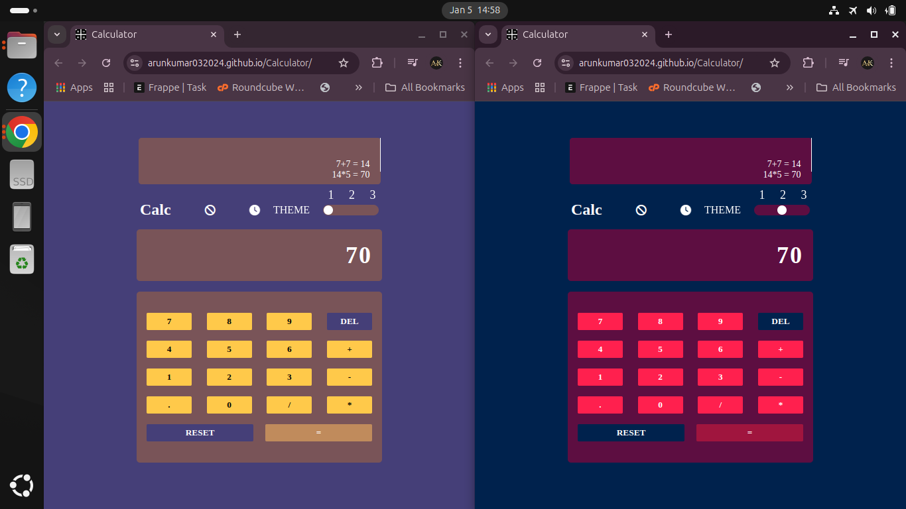

# Responsive Calculator with Theme Switcher  

A stylish and functional calculator built using **HTML**, **CSS**, and **JavaScript**. It is responsive, user-friendly, and comes with three unique themes to suit different preferences.  

## Features  
- 📱 **Responsive Design**: Optimized for all devices.  
- 🎨 **Theme Switcher**: Choose between three elegant themes.  
- ✨ **Real-Time Calculation**: Perform basic arithmetic operations efficiently.  
- 🧹 **Clear and Reset Options**: Easy to clear inputs or reset the entire calculation.  

## Live Demo  
Explore the calculator here: [Live Demo](https://arunkumar032024.github.io/Calculator/)  

## Technologies Used  
- HTML  
- CSS  
- JavaScript  

## Screenshots  
  

## Installation  
1. Clone the repository:  
   ```bash
   git clone https://github.com/arunkumar032024/Calculator.git
